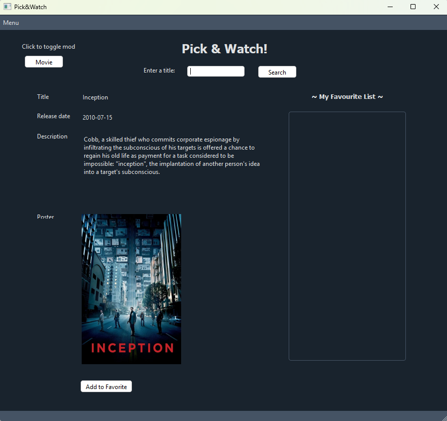
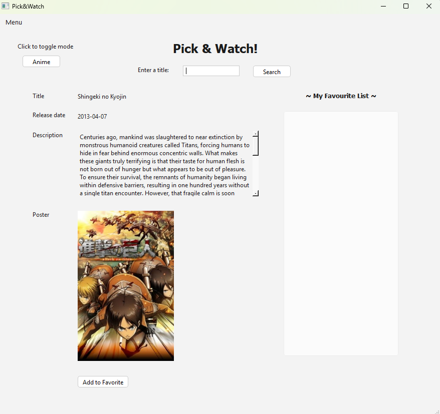

A simple app to search and save movies and animes. Built with PySide6.

# Features
- Search movies (via TMDB) or anime (via Jikan)
- View title, release date, description, and poster
- Save/load separate favorite lists for movies and anime
- Right-click to delete from favorites
- Switch between movie and anime modes

Important: Replace the placeholder API key in api.py with your own TMDB API key.

Screenshots:
Movie mode:

Anime mode:

